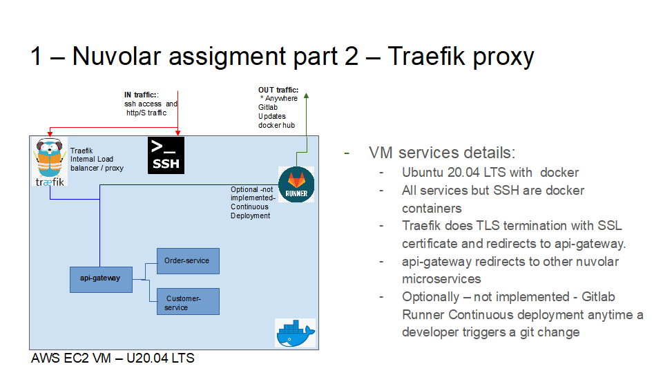

# 1 - Context and objective

These terraform, shell script and docker-compose code files are just to solve the assigment Part 2 proposed by Nuvolar Cloud with minimal direct cost from my side (certificate and domain cost).

In fact, we are taking the easiest approach proposed in this [document](https://docs.google.com/document/d/1HAYqUc2f9wCuLpat0eQIfZj4OuCvWleRjPYy23yoaHk/edit#heading=h.rxj3xvfrhhmb) consisting on:



 - Terraform script provisioning AWS VPC and AWS EC2 VM with SSD disk, ubuntu 20.04 LTS, VM must have a public ip.
 - VM AMI where docker environment is already configured and we use Docker Compose to configure Traefik + 3 Nuvolar microservices mentioned above in the assigment.
 - We use Traefik built-in self-signed certificate. Traefik will route the traffic to service-api microservervice
- In the Docker environment 1 docker network is created external(traefik) and internal.
- Traefik service will sit on traefik external network
- Nuvolar api-gateway microservice will sit on extenal traefik network so that it can take traffick coming from traefik SSL termination and redirect to customer-service and order-api microservices

# 2 - How to create the environment
## 2.1 - Prerequisites 
- awscli
- terraform
- git to clone repo: git clone https://github.com/inigokintana/nuvolar-assigment-2-ec2-docker-ssl.git


## 2.2 - Terraform quick Setup

Update the `backend.tf` and update the s3 bucket name and the region of your s3 bucket. Bucket names must be unique in AWS.
- profile if you are not using the default profile
- region if not using AWS Ireland region eu-west-1

Update the `variables.tf`:
- profile if you are not using the default profile
- region if not using AWS Ireland region eu-west-1
- ami-id: "ami-0338e6ca1aba01dc4" - please send me your AWS account id to share access  to this private image on  my AWS 733109890878 account id in eu-west-1
- ec2_key_name to add your selected Key pairs to access via ssh to the new provisioned EC2 VM - Must have "tag:Component" with "terraform" value so the Terraform can find it
- ec2_user_public_rsa so you can set copy public rsa to access via ssh inside the new provisioned EC2 VM to another selected user
```
- Initialize the project: terraform init

- Validate that the project is correctly setup: terraform validate

- Run the plan command to see all the resources that will be created: terraform plan

- Run the apply command to create the resources: terraform apply

- To destroy resources: terraform destroy
```
If you get errors deleting the resources, remove the .terraform folder and destroy again.
```
- rm -rf .terraform
- terraform destroy
```
## 2.3 - Test if it is working
### 2.3.1 - From inside AWS VM machine

curl -k not to check Traeffik internal certificate:
```
Traefik dashboard: 
curl -k  https://dashboard.ikz.com/dashboard/#/

Nuvolar microservices:
curl -k  https://api-gateway.ikz.com/order

returns -> {"id":1,"customerId":1,"amount":80.0}
```
### 2.3.2 - From your PC
- get the VM public ip address from AWS console and add following names in your /etc/hosts (Linux or Mac) o c:/windows/system32/drivers/etc/hosts
```
public-ip dashboard.ikz.com api-gateway.ikz.com order-api.ikz.com  customer-service.ikz.com
```

From browser try both:
```
- Traefik dashboard: https://dashboard.ikz.com/dashboard/#/

- Nuvolar microservices: https://api-gateway.ikz.com/order

returns -> {"id":1,"customerId":1,"amount":80.0}
```

## 2.4 - Nice to have - Next Steps

2 options to avoid using AMI:

Option 1:
 - shell script and docker-compose  in S3 bucket
 - EC2 instace profile role to access S3 bucket above
 - mount it with FUSE locally so in user data everything  can be executed  (shell script + docker-compose.yml) at instance provisioning stage

Option 2:  use remote exec provisioner , see [link](https://developer.hashicorp.com/terraform/language/resources/provisioners/remote-exec) 


** Pending to be fix ** : Traefik SSL certificate with Let's encrypt